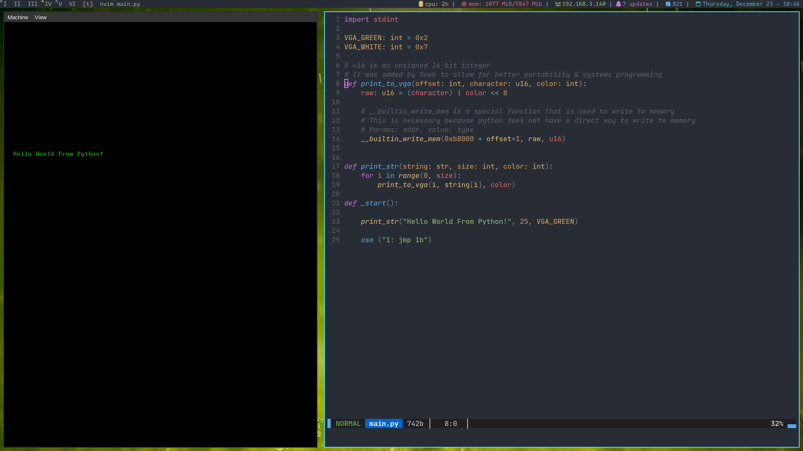

# pythonOS
An operating system kernel made in python and assembly

## Wait what?
It uses a custom compiler called [snek](https://github.com/Abb1x/snek) that implements a part of python3.9 (very limited right now)

## Screenshots

